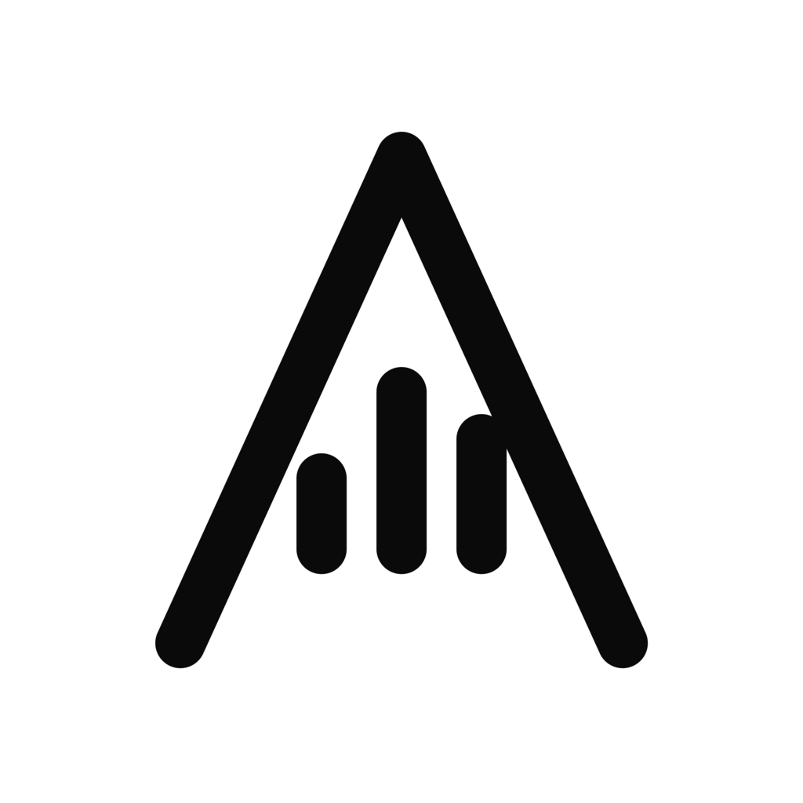
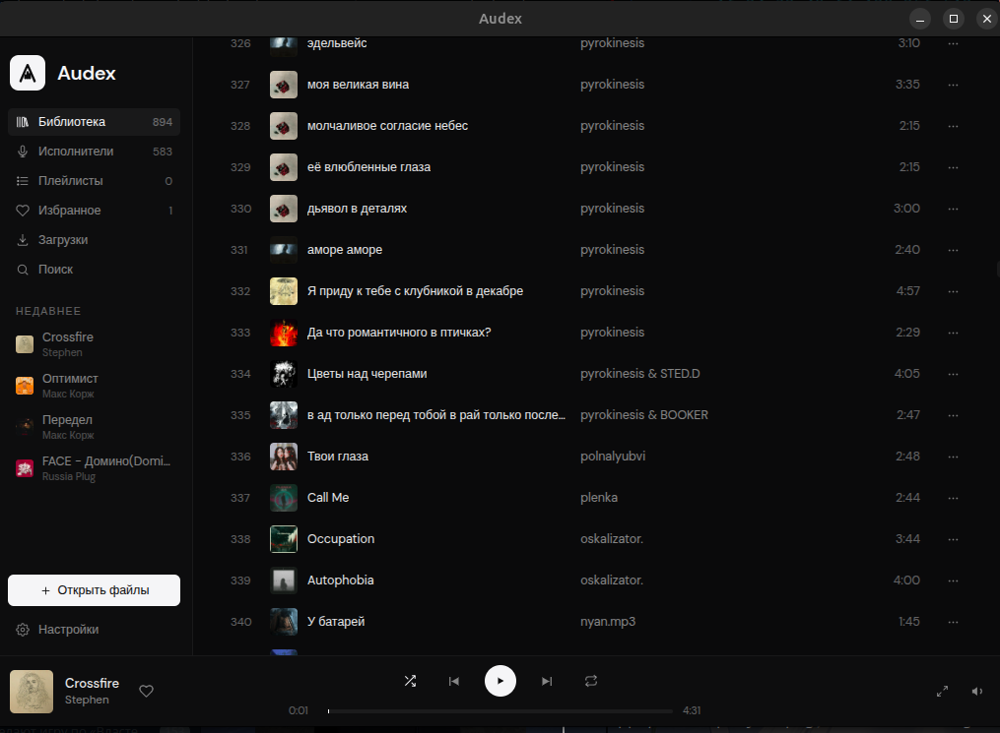
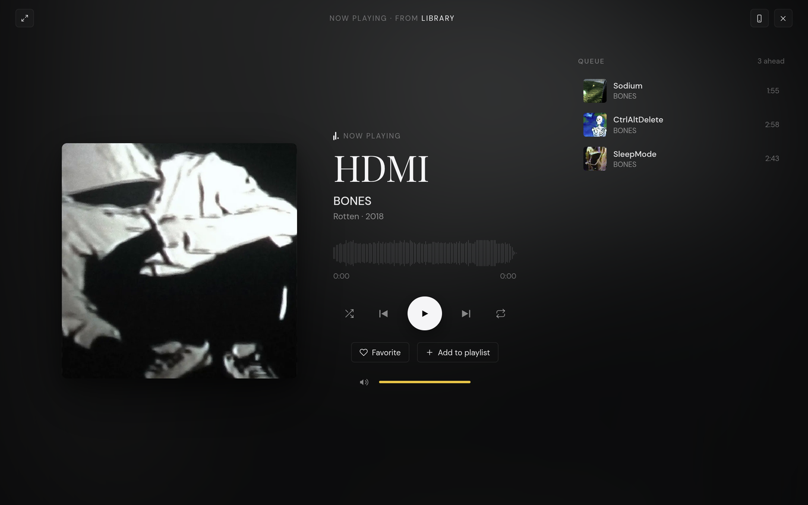
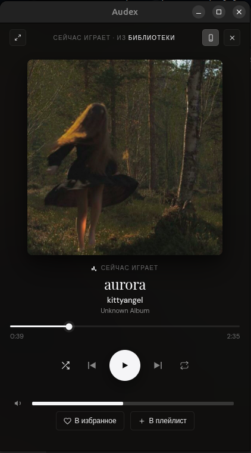
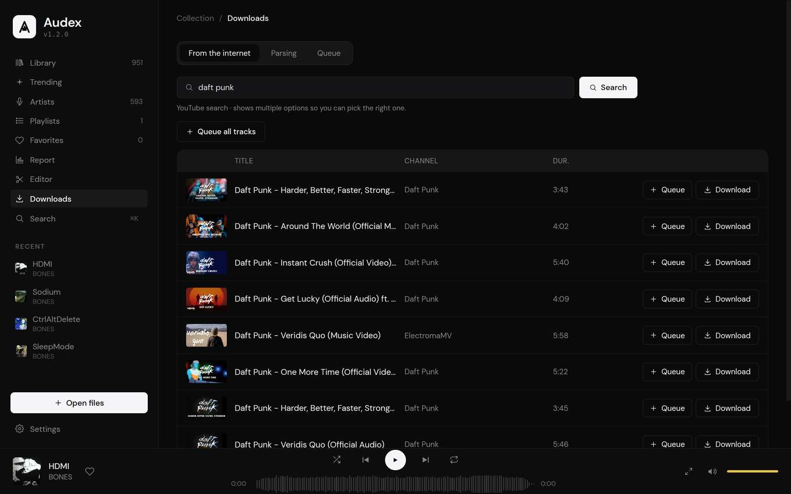

<div align="center">



# Audex

**A minimal desktop music player for your local audio library.**

Built with Electron and vanilla JS — no frameworks, no bloat, just a clean charcoal-and-amber player that scans your files, downloads new tracks, and stays out of your way.

[](https://github.com/MishaSok/audex-player/releases/latest)
[](https://github.com/MishaSok/audex-player/releases/latest)
[](LICENSE)
[](https://www.electronjs.org/)

[Download](#-download) · [Features](#-features) · [Build from source](#%EF%B8%8F-building-from-source) · [Contact](#-contact)

</div>

---

## 📸 Screenshots

<div align="center">

<!-- Hero: the main Library view with the track table populated -->


</div>

<table>
  <tr>
    <td width="50%"><!-- Fullscreen "now playing" view (desktop layout) -->
      </td>
    <td width="50%"><!-- Mobile / portrait "mobile player" mode -->
      </td>
  </tr>
  <tr>
    <td colspan="2"><!-- Downloads tab with a YouTube search or Yandex parse in progress -->
      </td>
  </tr>
</table>

> **📷 Which screenshots to add** — drop these four PNGs into `docs/screenshots/`:
>
> | File | What to capture |
> | --- | --- |
> | `library.png` | The **Library** view with the track table full of songs (this is the hero image, shown wide). |
> | `now-playing.png` | The **fullscreen "now playing"** view on desktop — cover, controls, volume slider, queue. |
> | `mobile.png` | The **mobile / portrait mode** — open fullscreen, then tap the mobile-mode button. |
> | `downloads.png` | The **Downloads** tab mid-action — a YouTube search result list or a Yandex Music parse. |
>
> Use the dark theme for a consistent look. Capture the window at a normal desktop size (≈1280×820).

---

## ✨ Features

### 🎵 Library & playback

- **Local library scanning** — recursive import of `.mp3`, `.wav`, `.ogg`, `.flac`, `.m4a`, `.aac` files.
- **Tag & cover art reading** via `music-metadata`; **MP3 tag editing** (title, artist, album, year, genre, track/disc number, comment, cover) written back with `node-id3`.
- **Playlists, Favorites, Recents** — organize your music however you like.
- **Artists view** — automatically grouped from your library.
- **Search & command palette** (`Ctrl/⌘ + K`) — jump to any track or view instantly.
- **Filters & sorting** — sort the library by title, artist, album, and more.
- **Playback controls** — shuffle, repeat (off / all / one), seek, volume.
- **Fullscreen "now playing"** view with cover art, full transport controls, volume slider, and an upcoming-queue panel.
- **Resume on launch** — the last track is restored when you reopen the app.

### ⬇️ Download from the internet

- **YouTube** — search and download tracks by query straight from the app (`yt-dlp`), with automatic import into your library, embedded cover art and metadata.
- **Yandex Music** — parse playlists and albums via a bundled headless Chromium. Your login session persists between runs; the browser window can be shown for sign-in / captcha or hidden for silent background parsing.
- **Download queue** with live progress, pause and resume. Queue state survives restarts.
- **Configurable download folder** — choose where new tracks land, or fall back to a dedicated `Audex Downloads` folder.

### 📱 Mobile listening mode

- A dedicated **portrait "mobile player"** layout for the fullscreen view.
- Fully **adaptive** — cover, titles and spacing scale smoothly from a phone-sized window up to a full screen.
- **Fullscreen-aware** — if the OS window is already fullscreen, mobile mode reflows in place instead of shrinking the window.

### 🎨 Interface

- **Five UI languages** — Russian, English, German, French, Ukrainian.
- **Dark / light / system** theme, with a single charcoal-and-amber Mono design.
- **UI scale** setting — make the whole interface larger or smaller, applied instantly.
- **Responsive layout** — adapts gracefully to narrow desktop windows.
- Polished **animations** for now-playing transitions and UI controls (respecting `prefers-reduced-motion`).

### 🖥️ System integration

- **MPRIS / Media Session** — now-playing metadata and transport controls appear in the GNOME top bar (and other OS media widgets).
- **Mini-player navigation** — click the cover to open fullscreen, click the title/artist to jump to the library or artist page.

---

## ⌨️ Keyboard shortcuts

| Shortcut | Action |
| --- | --- |
| <kbd>Ctrl</kbd> / <kbd>⌘</kbd> + <kbd>K</kbd> | Open / close the search command palette |
| <kbd>Ctrl</kbd> / <kbd>⌘</kbd> + <kbd>E</kbd> | Edit tags of the current track |
| <kbd>Space</kbd> | Play / pause |
| <kbd>Esc</kbd> | Close the fullscreen view or any open dialog |
| <kbd>↑</kbd> / <kbd>↓</kbd> | Move between results in the command palette |
| <kbd>Enter</kbd> | Run the highlighted command-palette result |

---

## 📦 Download

Grab the latest build for your platform from the [**Releases page**](https://github.com/MishaSok/audex-player/releases/latest):

| Platform | File |
| --- | --- |
| **Linux** | `Audex-1.1.0.AppImage` (portable) or `audex-player_1.1.0_amd64.deb` |
| **macOS** (Apple Silicon) | `Audex-1.1.0-arm64.dmg` |
| **Windows** | `Audex.Setup.1.1.0.exe` |

> **Note:** builds are unsigned.
> - **macOS** — right-click the app → **Open**, or run `xattr -d com.apple.quarantine /Applications/Audex.app`.
> - **Windows** — SmartScreen may warn; click **More info → Run anyway**.

### Runtime dependency

The YouTube downloader needs [`yt-dlp`](https://github.com/yt-dlp/yt-dlp) installed on your system:

```bash
pip install -U yt-dlp
```

The Yandex Music parser uses a Chromium build bundled with the app — no extra setup required.

---

## 🛠️ Building from source

```bash
git clone https://github.com/MishaSok/audex-player.git
cd audex-player
npm install
npm start
```

`npm start` runs `electron . --no-sandbox` (the flag avoids sandbox permission issues on some Linux setups).

To produce distributable packages:

```bash
npm run dist
```

This builds a Linux AppImage and `.deb` into `release/`. macOS and Windows builds are produced by GitHub Actions on tag push.

---

## 🧰 Tech stack

- **[Electron 42](https://www.electronjs.org/)** — desktop shell (main + preload + renderer processes).
- **Vanilla HTML / CSS / JS** — no UI framework, no bundler.
- **[music-metadata](https://github.com/borewit/music-metadata)** — read tags and embedded artwork.
- **[node-id3](https://github.com/Zazama/node-id3)** — write ID3v2 tags back to MP3 files.
- **[Puppeteer](https://pptr.dev/)** — drives the bundled Chromium for the Yandex Music parser.
- **[yt-dlp](https://github.com/yt-dlp/yt-dlp)** — YouTube search and download backend.

---

## 📬 Contact

Made by **Mikhail Sokov**.

- 💬 **Telegram:** [@JuicexNet](https://t.me/JuicexNet) — *found a bug or have a suggestion? Message me here.*
- 🐙 **GitHub:** [MishaSok/audex-player](https://github.com/MishaSok/audex-player)
- ✉️ **Email:** mikhail.sokov2006@gmail.com

---

## 📄 License

Released under the [MIT License](LICENSE).
