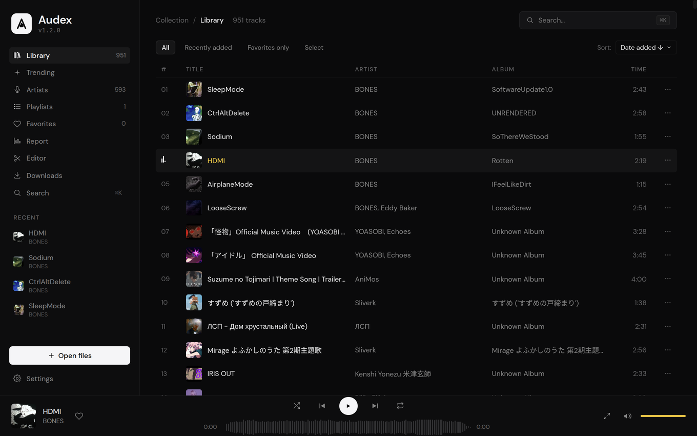
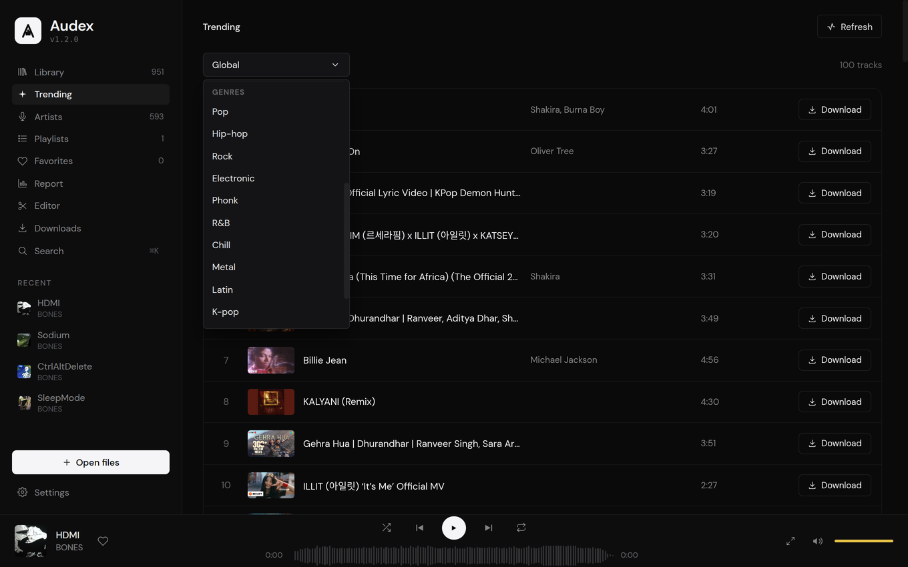
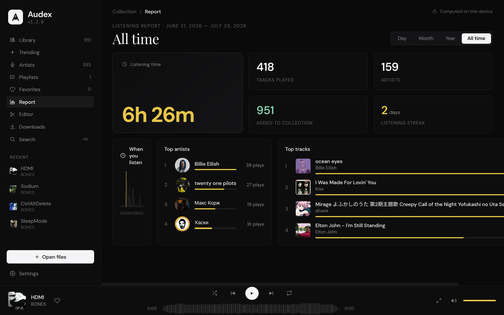
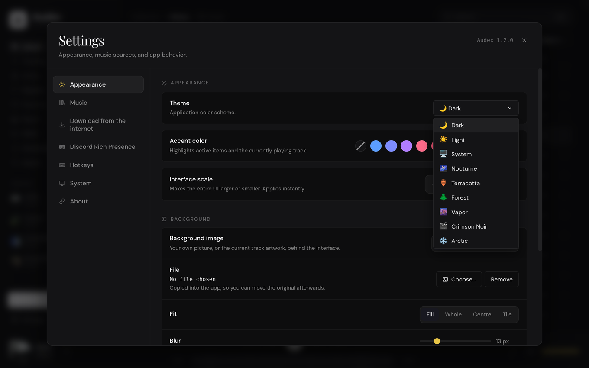
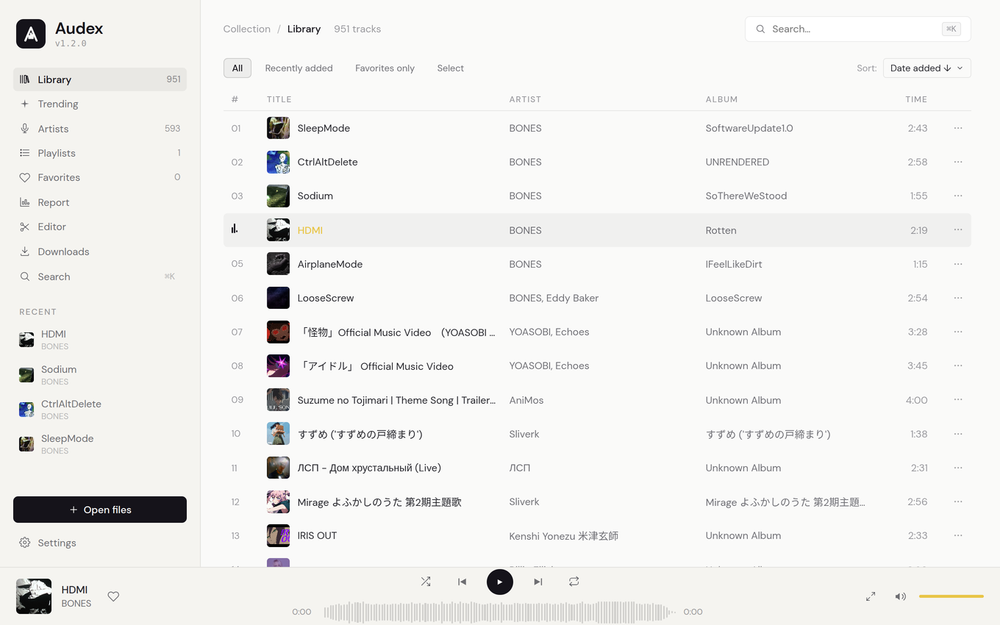
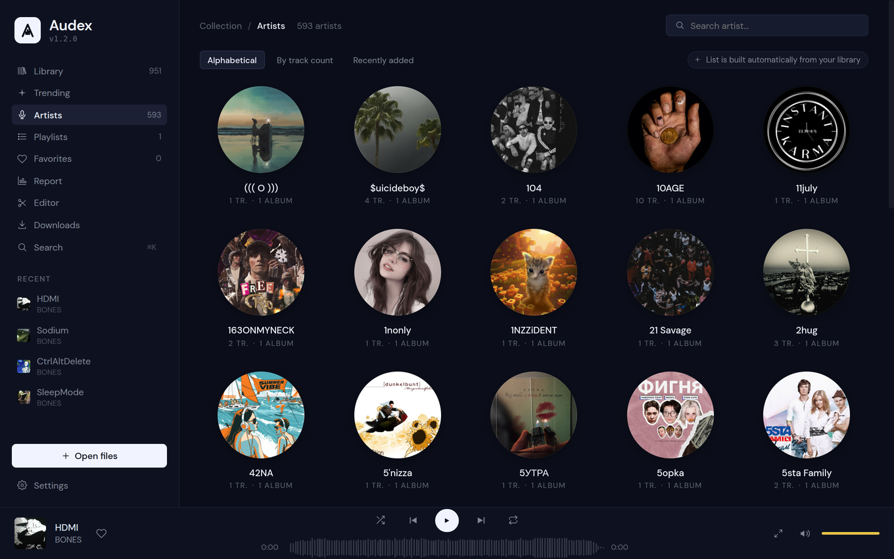

<div align="center">


# Audex

### Your music. Your machine. No account, no subscription, no cloud.

A fast, beautiful desktop player for the music you actually own — and a one-click way to get more of it.

[](https://github.com/MishaSok/audex-player/releases/latest)
[](https://github.com/MishaSok/audex-player/releases/latest)
[](LICENSE)

### [⬇️  Download the latest release](https://github.com/MishaSok/audex-player/releases/latest)

*Free and open source. No telemetry, no ads, no sign-up.*

</div>



---

## Why you'll like it

- **It's yours.** Point it at a folder and it just works — offline, forever. Nothing is uploaded anywhere.
- **It's quick.** Thousands of tracks scroll without a stutter — the list is virtualized and every cover is cached to disk after the first scan.
- **It looks good.** Nine themes, any accent color you like, your own wallpaper behind the interface.
- **It fills the gaps.** Missing a track? Search YouTube, paste a Spotify or Yandex playlist, or grab what's charting today — without leaving the app.
- **It respects you.** Your listening stats are computed on your device and never leave it.

---

## See it in action

### Charts by country *and* genre

Browse what's trending worldwide or dive into a genre — Pop, Hip-hop, Phonk, Metal, K-pop and more. One click downloads the track, tags and cover art included.



### Your year in music, computed locally

Listening time, top artists and tracks, a streak counter, and a clock showing when you actually listen. Day, month, year or all-time — none of it ever leaves your machine.



### Nine themes, one click

Dark, Light, System, plus six hand-tuned palettes: Nocturne, Terracotta, Forest, Vapor, Crimson Noir and Arctic. Pick any accent color to go with them.

<table>
  <tr>
    <td width="50%"></td>
    <td width="50%"></td>
  </tr>
  <tr>
    <td colspan="2"></td>
  </tr>
</table>

### A player worth going fullscreen for

Real waveform seeking, an upcoming-queue panel, and a portrait "mobile player" mode for when the window is narrow.

<table>
  <tr>
    <td width="68%"></td>
    <td width="32%"></td>
  </tr>
</table>

### Search it, queue it, done


---

## Features

<details open>
<summary><b>🎵 Library &amp; playback</b></summary>

- Recursive import of `.mp3`, `.wav`, `.ogg`, `.flac`, `.m4a`, `.aac`.
- Tags and cover art read via `music-metadata`; **MP3 tag editing** written back with `node-id3`.
- **Playlists, Favorites, Recents**, and an **Artists** view grouped automatically from your library.
- **Command palette** (<kbd>Ctrl/⌘</kbd>+<kbd>K</kbd>) — jump to any track or view instantly.
- Shuffle, repeat (off / all / one), sorting, filtering, and **resume on launch**.
- **Real-waveform seek bar** — the actual audio peaks, in both the playbar and the fullscreen player.
- **Crossfade** between tracks *(optional)*.
- **Track trimmer** *(optional)* — cut a track with optional fades; lossless when no fade is applied.
- **Library health-check** *(optional)* — finds suspected transcodes, low bitrates, missing covers, incomplete tags and duplicates.

</details>

<details open>
<summary><b>⬇️ Get new music</b></summary>

- **YouTube** — search and download by query, with cover art and metadata embedded automatically.
- **YouTube Music** — paste an album, single or artist link and parse the full track list.
- **Spotify**, **Yandex Music** and **VK** — parse playlists and albums, then download them through the shared queue.
- **Trending** — YouTube Music charts for 9 countries and 13 genres, downloadable in one click.
- **Download queue** with live progress; queue state survives restarts.
- Choose where new tracks land, or let them go to a dedicated `Audex Downloads` folder.

</details>

<details open>
<summary><b>🎨 Interface</b></summary>

- **Five languages** — English, Russian, German, French, Ukrainian.
- **Nine themes** and a **customizable accent color**.
- **Custom background** — your own image or the current album art, with blur and dim controls.
- **UI scale** and a **responsive layout** that adapts to narrow windows.
- **Portrait "mobile player"** mode for the fullscreen view.

</details>

<details open>
<summary><b>🖥️ System integration</b></summary>

- **System tray** — transport controls; closing the window keeps music playing.
- **MPRIS / Media Session** — now-playing info and controls in the GNOME top bar and other OS media widgets.
- **Global hotkeys** — control playback even when the window isn't focused.
- **Discord Rich Presence** — track, artist and album cover on your profile, with an optional timer and custom buttons.
- **Update notifications** — a dismissible in-app banner when a new release is out.

</details>

---

## ⌨️ Keyboard shortcuts

| Shortcut | Action |
| --- | --- |
| <kbd>Ctrl</kbd>/<kbd>⌘</kbd> + <kbd>K</kbd> | Open the search command palette |
| <kbd>Ctrl</kbd>/<kbd>⌘</kbd> + <kbd>E</kbd> | Edit tags of the current track |
| <kbd>Ctrl</kbd>/<kbd>⌘</kbd> + <kbd>,</kbd> | Open settings |
| <kbd>Space</kbd> | Play / pause |
| <kbd>Esc</kbd> | Close the fullscreen view or any dialog |
| <kbd>↑</kbd> / <kbd>↓</kbd> · <kbd>Enter</kbd> | Navigate and run palette results |

Every playback shortcut is rebindable in **Settings → Hotkeys**, and can be made system-wide.

---

## 📦 Download

Grab the latest build from the [**Releases page**](https://github.com/MishaSok/audex-player/releases/latest):

| Platform | File |
| --- | --- |
| **Linux** | `Audex-1.2.0.AppImage` (portable) or `audex-player_1.2.0_amd64.deb` |
| **macOS** (Apple Silicon) | `Audex-1.2.0-arm64.dmg` |
| **Windows** | `Audex.Setup.1.2.0.exe` |

**Nothing else to install.** `yt-dlp`, `ffmpeg` and Chromium all ship inside the app — downloading and parsing work out of the box.

> **Builds are unsigned**, so the OS will ask once:
> - **macOS** — right-click the app → **Open**, or run `xattr -d com.apple.quarantine /Applications/Audex.app`.
> - **Windows** — SmartScreen may warn; click **More info → Run anyway**.

---

## 🛠️ Build from source

```bash
git clone https://github.com/MishaSok/audex-player.git
cd audex-player
npm install
npm start
```

`npm start` runs `electron . --no-sandbox` (the flag avoids sandbox permission issues on some Linux setups).

```bash
npm run dist   # Linux AppImage + .deb into release/
```

macOS and Windows builds are produced by GitHub Actions on tag push.

---

## 🧰 Built with

**[Electron 42](https://www.electronjs.org/)** · vanilla HTML/CSS/JS — no framework, no bundler · **[music-metadata](https://github.com/borewit/music-metadata)** · **[node-id3](https://github.com/Zazama/node-id3)** · **[yt-dlp](https://github.com/yt-dlp/yt-dlp)** · **[ffmpeg-static](https://github.com/eugeneware/ffmpeg-static)** · **[Puppeteer](https://pptr.dev/)**

---

## 📬 Contact

Made by **Mikhail Sokov**.

- 💬 **Telegram:** [@JuicexNet](https://t.me/JuicexNet) — *found a bug or have an idea? Message me.*
- 🐙 **GitHub:** [MishaSok/audex-player](https://github.com/MishaSok/audex-player)
- ✉️ **Email:** mikhail.sokov2006@gmail.com

---

<div align="center">

**[⬇️  Download Audex](https://github.com/MishaSok/audex-player/releases/latest)** · Released under the [MIT License](LICENSE).

</div>
